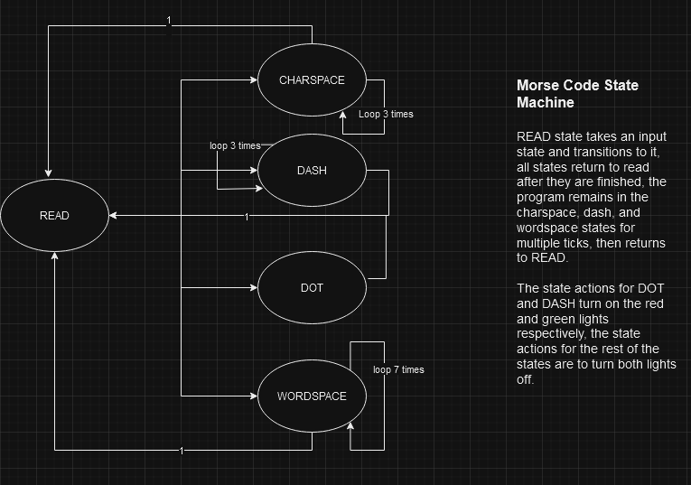
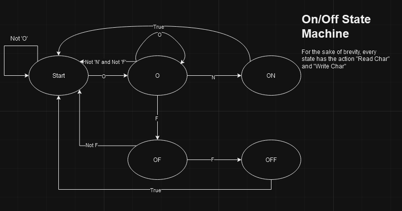
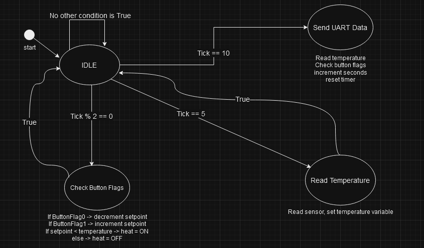
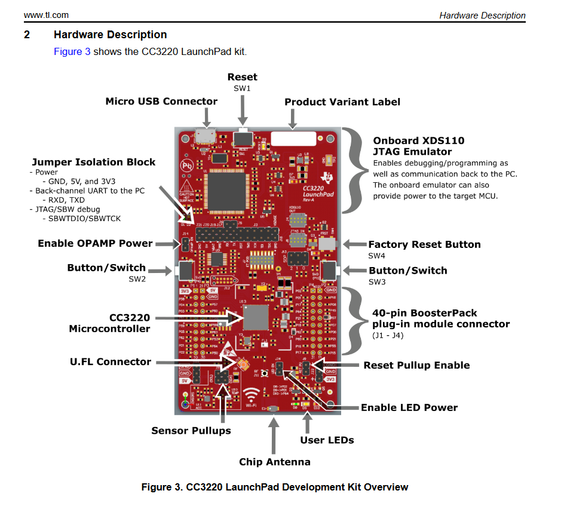

# TI CC3220S Projects

## Final Project Reflection
### - Summarize the project and what problem it was solving.
  This project used the CC3220S board to create a smart thermostat prototype that would be connected to the cloud in the future. It read the ambient temperature from the sensor and simulated sending the temperature, setpoint, heat, and seconds elapsed to an API using a simple UART2 setup.
### - What did you do particularly well?
  What I did well in this project was creating a simple and elegant state machine to solve this problem efficiently. I utilized the correct data types for each variable which prevents using unneccessary memory. 
### - Where could you improve?
  I could improve the project by ensuring that my header files only expose the necessary data to prevent circular dependencies and importing header files that have already been included as a side-effect.
### - What tools and/or resources are you adding to your support network?
  For TI development, I will be adding the TI E2E support forums to my support network along with the file references TI provides for its header files such as UART2.h File Reference, Timer.h File Reference, and the CC3220S User Guide and Data Sheet.
### - What skills from this project will be particularly transferable to other projects and/or course work?
  This course was the first time I've ever written code for an embedded system. I learned a lot about different low-level protocols and constructs such as timers, interrupts, I2C, UART, GPIO, and others. At the very least (if I never touch an embedded system again, which I hope is not the case as I enjoyed this), understanding low-level constructs will help me solve higher-level problems more efficiently by understanding how the underlying hardware functions.
### - How did you make this project maintainable, readable, and adaptable?
  To make my project maintainable, readable, and adaptable, I broke down common and simple tasks into their own functions so that everything can be tested individually. I also separated different concerns into different modules such as init, callbacks, and utils, which keeps the main file clean and uncluttered by initialization and other supplemental tasks.

## GPIO Interrupt

Uses interrupts and timers to blink Morse code messages. Toggles Morse code message state with SW2. User LED D10 corresponds to DOT and blinks 500ms, D8 corresponds to DASH and blinks 1500ms. Period is set to 500ms, so the DASH state is active for 3 ticks. Character pauses are handled in the CPAUSE state which lasts 3 ticks. Word pauses are handled in the WPAUSE state and last 7 ticks. A timer interrupt is set up to trigger continuously over the specified period by setting the timerMode param to Timer_CONTINUOUS_CALLBACK. When SW2 is pressed, the Morse code message toggles between SOS and OK. If it is pressed in the middle of a message, the message finishes before switching. An interrupt triggers the gpioButtonFxn0, which corresponds to CONFIG_GPIO_BUTTON_0, which is set to SW2 in gpiointerrupt.syscfg.

## UART2 Echo

Uses the CC3220S UART device to control User LEDs by sending messages ("On" or "Off") from serial terminal.

## Final Project

CC3220 figure retrieved from _TI User's Guide CC3220 SimpleLink™ Wi-Fi® LaunchPad™ Development
Kit Hardware_. https://www.ti.com/lit/ug/swru463c/swru463c.pdf?ts=1728229889379 Page 7
